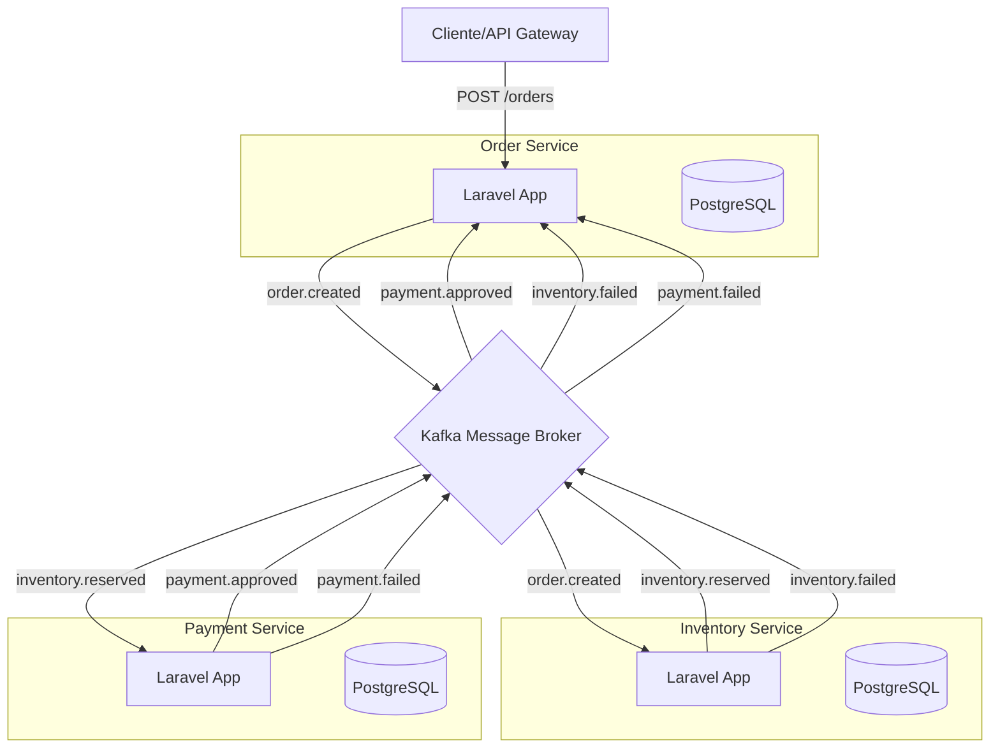

# Architecture

Este documento descreve a arquitetura de alto nível do projeto `laravel-event-driven-store`.

## 🏗️ Visão Geral dos Componentes

O sistema segue uma arquitetura de microsserviços onde cada serviço possui sua própria responsabilidade e seu próprio banco de dados isolado (Database per Service pattern). A comunicação entre os serviços é puramente assíncrona, mediada pelo **Apache Kafka**.

## 🔄 Fluxo de Negócio (Saga Pattern)

Para garantir a consistência eventual entre os serviços, utilizamos eventos para orquestrar o fluxo de um pedido.

1.  **Order Service**: Recebe o pedido, salva como `PENDING` e emite `order.created`.
2.  **Inventory Service**: Escuta `order.created`, reserva os itens e emite `inventory.reserved`. Caso não haja estoque, emite `inventory.failed`.
3.  **Payment Service**: Escuta `inventory.reserved`, processa o pagamento e emite `payment.approved`. Caso o pagamento falhe, emite `payment.failed`.
4.  **Order Service**: Escuta os eventos finais para atualizar o status do pedido para `COMPLETED`, `CANCELLED` ou `PAYMENT_FAILED`.
